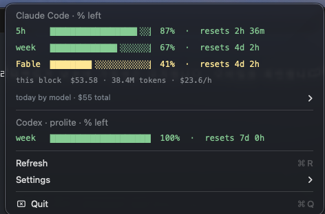
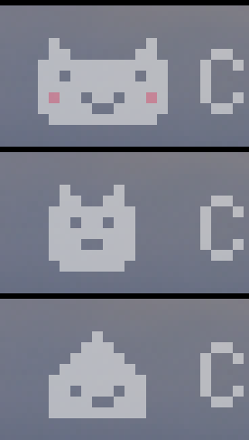

# 🔋 Claude & Codex Usage Battery

<p align="center">
  <a href="LICENSE"></a>
  
  
  
</p>

> A macOS menu bar app that shows how much of your **Claude Code** and **Codex** rate limits you have left — as tiny pixel batteries. So you never have to run `/usage` again.

<p align="center">
  
</p>

`C` = Claude · `X` = Codex. Each battery is the **remaining %** of one limit window: full and green means plenty left, red means almost out. Click it for exact percentages and reset countdowns.

This is a personal, customized build of [dennykim123/claude-codex-battery](https://github.com/dennykim123/claude-codex-battery) (MIT). It is **not notarized and there are no prebuilt downloads** — you build it yourself with one command, which takes about a minute. See [What's different](#whats-different-from-upstream).

---

## What it shows

| Group | Batteries | Where the numbers come from |
|-------|-----------|------------------------------|
| **`C` Claude** | 5-hour session · weekly · top-model weekly cap | Anthropic's OAuth usage API, queried with your local Claude Code login. **Account-level**, so usage from every device and surface is included — the same data `/usage` shows. |
| **`X` Codex** | 5-hour · weekly (or credit balance) | Codex's account-level usage API, queried with your local Codex login — the same data Codex CLI's `/status` shows. Falls back to `~/.codex/sessions/**/*.jsonl` when offline. |

<p align="center"></p>

```
Claude Code · % left
  5h    ▕█████████████████▍░░▏ 87%  ·  resets 2h 36m
  week  ▕█████████████▍░░░░░░▏ 67%  ·  resets 4d 2h
  Fable ▕████████▎░░░░░░░░░░░▏ 41%  ·  resets 4d 2h
  today by model · $55 total ▸

Codex · prolite · % left
  week  ▕████████████████████▏ 100% ·  resets 7d 0h

updated 14:01:51
Refresh
Settings ▸
```

Colors follow a traffic light scale: green ≥ 50% left, amber < 50%, red < 20%.

---

## Requirements

| | Required? | How to get it |
|---|---|---|
| **macOS 12 (Monterey) or later** | ✅ | — |
| **Xcode Command Line Tools** | ✅ to build | `xcode-select --install` — provides `swiftc`. Nothing else is needed; no Xcode, no Homebrew, no package manager. |
| **Claude Code, logged in on this Mac** | for the `C` batteries | The app reuses your existing login. Check with `claude auth status`. |
| **Codex CLI, logged in on this Mac** | for the `X` batteries | Check with `codex login status`. Without it, only the Claude batteries appear. |
| **[ccusage](https://github.com/ryoppippi/ccusage)** | optional | Adds the cost / token / per-model breakdown to the dropdown. The batteries work fully without it. |

The app only ever shows **your own account's** limits. If you don't use Claude Code or Codex on this Mac, there is nothing for it to display.

---

## Install

### 1. Build it

```bash
git clone https://github.com/SeongMon/claude-codex-battery.git
cd claude-codex-battery/app
./build.sh
```

`build.sh` compiles the Swift sources, assembles `ClaudeCodexBattery.app`, and ad-hoc signs it for local use. It finishes with:

```
✅ Build complete: …/app/ClaudeCodexBattery.app (v2.6.3)
```

### 2. Move it to Applications and launch it

```bash
cp -R ClaudeCodexBattery.app /Applications/
open /Applications/ClaudeCodexBattery.app
```

Because you compiled it on this Mac, there is no Gatekeeper warning and no "unidentified developer" dialog to click through.

### 3. Answer the two first-launch prompts

- **"Start automatically at login?"** — pick whichever you prefer; you can change it later in **Settings → Start at login**.
- **A Keychain prompt** for the `Claude Code-credentials` item, because that is where Claude Code keeps the login token the app reads. Click **Always Allow**. (Clicking *Deny* means no Claude batteries; see [Troubleshooting](#troubleshooting).)

The batteries appear in your menu bar within a few seconds. That's the whole install.

---

## Using it

- **Click the batteries** for the dropdown: one gauge row per limit window with its reset countdown, an `updated HH:MM:SS` stamp, and a 🏁 lap row telling you whether your current burn rate reaches the 5-hour reset without running empty.
- **It refreshes on its own every 2 minutes**, and again the moment you open the dropdown if that data has gone stale. A refresh that lands while the dropdown is open rewrites the rows in place — no need to close and reopen it.
- **Refresh** (or <kbd>⌘R</kbd> with the menu open) forces an immediate update. It first re-checks both CLI logins so an expired token gets renewed, then re-reads the usage and pops the dropdown back open with the new numbers. It takes about 2–3 seconds and costs no tokens.
- **Settings** holds battery size (small by default), the optional pixel mascot (off by default), UI language, and start-at-login.

<p align="center"></p>

**UI languages:** English · 한국어 · 日本語 · 简体中文 · 繁體中文 · Español — follows your system language, or pick one in **Settings → Language**.

---

## Updating

There is no in-app updater in this build ([on purpose](#whats-different-from-upstream)). To move to a newer commit, pull and rebuild:

```bash
cd claude-codex-battery
git pull
./app/build.sh
osascript -e 'quit app "ClaudeCodexBattery"'
rm -rf /Applications/ClaudeCodexBattery.app
cp -R app/ClaudeCodexBattery.app /Applications/
open /Applications/ClaudeCodexBattery.app
```

## Uninstall

Turn off **Settings → Start at login** first (so macOS forgets the login item), then:

```bash
osascript -e 'quit app "ClaudeCodexBattery"'
rm -rf /Applications/ClaudeCodexBattery.app
rm -f ~/.claude/swiftbar/.claude-usage.json ~/.claude/swiftbar/.codex-usage.json
```

Your Claude Code and Codex logins are untouched — the app never owned them.

---

## Privacy & security

- **Two outbound requests, both to first-party endpoints.** `api.anthropic.com/api/oauth/usage` with your Claude Code token, and `chatgpt.com/backend-api/wham/usage` with your Codex token. Nothing else leaves your Mac; upstream's daily update check is disabled in this build.
- **Tokens are read, never stored.** The Claude token comes from the Keychain item `Claude Code-credentials`, the Codex token from `~/.codex/auth.json`. Each is held in memory for the life of the process and sent only to the endpoint above — never written to a file, a log, or a command line.
- **No API keys are touched.** Only those OAuth login tokens; never `ANTHROPIC_API_KEY` / `OPENAI_API_KEY`.
- **Read-only, and free.** Both queries cost no tokens. **Refresh** additionally runs `claude auth status` and `codex login status` locally — status commands that renew a stale login without consuming anything.
- **No conversation content.** From the Codex session-log fallback the app parses the `rate_limits` numbers only.
- **Opt out of live queries entirely:** `touch ~/.claude/swiftbar/.no-live`. The app then reads its local cache files and never touches the Keychain or the network.

---

## What's different from upstream

- **The dropdown is live.** Opening it re-collects when the data is stale, and a refresh that arrives while it is open updates the visible rows in place. `Refresh` warms both CLI logins first, then reopens the dropdown with the new numbers, and an `updated HH:MM:SS` row makes it obvious that it landed.
- **The in-app self-updater is disabled**, so a local build is never silently replaced by an upstream release (which would undo the customizations below). Update by rebuilding.
- **Small batteries by default**, a customized menu bar icon, and a light dropdown backdrop so the gauge rows stay legible in both system themes.
- **Verification flags** for checking the app without clicking through the UI — see [Troubleshooting](#troubleshooting).

---

## Repository layout

| Path | What it is |
|---|---|
| `app/` | The macOS app — Swift sources plus `build.sh`. This is what you build. |
| `docs/` | Screenshots used by this README. |
| everything else | Upstream's other variants: a SwiftBar plugin (`claude-codex-usage.2m.js`, `install.sh`), a Linux/Chromebook terminal battery (`ccb`, `install-linux.sh`), and a Windows tray port (`windows/`). They are kept for reference; this fork only supports the macOS app. |

---

## Troubleshooting

| Symptom | Fix |
|---|---|
| `./build.sh` says `swiftc: command not found` | Install the command line tools: `xcode-select --install`, then run `./build.sh` again. |
| No batteries appear at all | Neither CLI is logged in on this Mac. Check `claude auth status` and `codex login status`, then click **Refresh**. |
| Only the Claude batteries appear | Codex isn't logged in (`codex login status`), or its usage window is currently empty. |
| The Keychain keeps asking on every refresh | You clicked *Deny* or *Allow* instead of **Always Allow**. Open **Keychain Access → login → Claude Code-credentials → Access Control** and allow it, or run `touch ~/.claude/swiftbar/.no-live` to stop the app from touching the Keychain at all. |
| The numbers look stale | Click **Refresh**; the `updated HH:MM:SS` row shows when the data was actually collected. A row reading `cached … ago` means the live query failed — check your network and logins. |
| Two sets of batteries in the menu bar | Upstream's SwiftBar plugin is running as well. Disable it in SwiftBar, or remove `~/.swiftbar-plugins/claude-codex-usage.2m.js`. |
| "The app is damaged and can't be opened" | Only happens if you copied a built `.app` from another Mac. Either rebuild locally, or `xattr -dr com.apple.quarantine /Applications/ClaudeCodexBattery.app`. |

**Checking it without the UI** — the app binary answers a few diagnostic flags:

```bash
APP=/Applications/ClaudeCodexBattery.app/Contents/MacOS/ClaudeCodexBattery
"$APP" --dump          # the collected data: live?, percentages, reset times
"$APP" --dump-menu     # the dropdown, as text
"$APP" --dump-refresh  # runs the Refresh path and prints before/after
```

---

## Credits

A fork of **[dennykim123/claude-codex-battery](https://github.com/dennykim123/claude-codex-battery)** by Denny Kim, customized for personal use. All credit for the original app, the pixel battery rendering and the usage plumbing goes there.

## License

[MIT](LICENSE)
